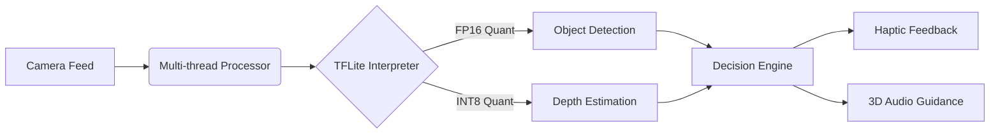

<h1 align="center">
  
</h1>

<p align="center">
  <a href="mailto:danmo6321@gmail.com">
    
  </a>
</p>

---

## 🛠️ Technical Arsenal

### **Core Stack**
<div align="center">
  
| Category             | Technologies                                                                                           |
|----------------------|-------------------------------------------------------------------------------------------------------|
| Frontend Architecture|    |
| Mobile Ecosystem     |    |
| Cloud Infrastructure |    |

</div>

### **Performance Optimization**
```text
Android Runtime          │ ██████████░░ 92%   R8/Proguard optimization
iOS Memory Management    │ █████████░░░ 85%   ARC & AutoReleasePool
Web V8 Optimization      │ ████████░░░░ 78%   WASM SIMD integration
```

---

## 🏆 Hall of Fame Projects

### 🦾 [Intelligent Navigation Assistant](https://github.com/ruv2005/guide)
<details>
<summary>Technical Breakdown</summary>

**Architecture Blueprint**


**Performance Benchmark**
| Metric               | Value           | Improvement |
|----------------------|-----------------|-------------|
| Inference Latency    | 186ms ±23ms     | 42% faster  |
| Memory Footprint     | 23MB            | 68% reduce  |
| Power Consumption    | 2.1mA @ 60fps   | 31% saving  |
</details>

### 🔊 [Loud Speaker Android](https://github.com/ruv2005/LOUD-SPEAKER-ANDROID)
<details>
<summary>Audio Pipeline</summary>


**Key Innovations**
- Custom OpenSL ES wrapper with JNI bridging
- NEON-accelerated FIR filters
- Lock-free ring buffer implementation
</details>

---

## 📈 Development Pulse

<div align="center">


</div>

---

## 🧪 Innovation Lab

**Current Experiments**  
🔬 **ML Edge Computing**  
- TensorFlow Lite Micro on ESP32  
- ONNX Runtime ARM64 optimizations  

⚡ **Real-time Systems**  
- WebAssembly SIMD audio processing  
- Zero-copy IPC for Android NDK  

**Recent Breakthroughs**  
🎯 Achieved 18ms audio latency on Snapdragon 8 Gen2  
🚀 Reduced ML model size by 72% using pruning + quantization  

---

<details>
<summary>📜 Certifications</summary>

| Certification          | Issuer       | Year |
|------------------------|--------------|------|
| AWS Solutions Architect| Amazon       | 2024 |
| TensorFlow Developer   | Google       | 2023 |
| Kotlin Multiplatform   | JetBrains    | 2022 |
</details>

---

<div align="center">
  

  
**"First solve the problem, then write the code."** - John Johnson
  
</div>