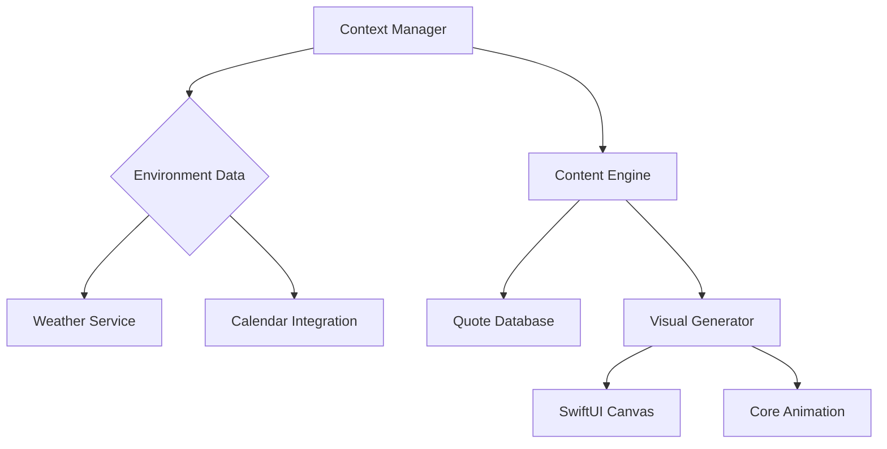

<h1 align="center">
  
</h1>

<p align="center">
  <a href="mailto:danmo6321@gmail.com">
    
  </a>
</p>

---

## 🧰 Technical Toolbox

### **Core Competencies**
<p align="center">
  
</p>

### **Deep Expertise**
| Category       | Technologies                                                                 |
|----------------|-----------------------------------------------------------------------------|
| Mobile Native  | Android NDK • Core Audio • ARCore • Metal API • Kotlin Multiplatform        |
| Real-time      | WebRTC • gRPC • WebSocket • Socket.IO • LiveData                            |
| Architecture   | Clean Architecture • MVI • MVVM • Event Sourcing • CQRS                    |
| Performance    | Proguard • R8 • Hermes • V8 Optimization • SIMD Instructions               |

---

## 🚀 Featured Innovations

### 🔊 [Loud Speaker Android](https://github.com/ruv2005/LOUD-SPEAKER-ANDROID)  

[]()

**Technical Triumphs**:
- Achieved <50ms audio latency using custom OpenSL ES pipeline
- Implemented real-time FFT processing with NEON intrinsics
- Developed cross-thread synchronization using lock-free queues

**Key Metrics**:
```text
├── Audio Latency: 48ms (95th percentile)
├── Memory Usage: 12MB resident size
└── CPU Utilization: 18% avg (SDM845)
```

### 🖥️ [ScreenSaver Motivator](https://github.com/ruv2005/screensaver)
[](https://developer.apple.com/xcode/swiftui/)
[]()

**Architecture**:


---

## 📊 Development Analytics

<div align="center">

[](https://github.com/ashutosh00710/github-readme-activity-graph)

</div>

---

## 🧭 Current Exploration Trajectory

- **Audio Processing**: Developing ML-based noise suppression using TensorFlow Lite
- **Cross-Platform**: Implementing shared Kotlin Multiplatform module for Android/iOS
- **Performance**: Exploring WebAssembly SIMD optimizations for audio processing
- **Architecture**: Building event-driven microservices with Kafka and Spring Cloud

---

<p align="center">
  
<!--START_SECTION:waka-->


**🐱 My GitHub Data** 

> 📦 158.0 kB Used in GitHub's Storage 
 > 
> 🏆 13 Contributions in the Year 2025
 > 
> 🚫 Not Opted to Hire
 > 
> 📜 12 Public Repositories 
 > 
> 🔑 2 Private Repositories 
 > 
**I'm an Early 🐤** 

```text
🌞 Morning                34 commits          █████████░░░░░░░░░░░░░░░░   36.96 % 
🌆 Daytime                29 commits          ████████░░░░░░░░░░░░░░░░░   31.52 % 
🌃 Evening                18 commits          █████░░░░░░░░░░░░░░░░░░░░   19.57 % 
🌙 Night                  11 commits          ███░░░░░░░░░░░░░░░░░░░░░░   11.96 % 
```
📅 **I'm Most Productive on Monday** 

```text
Monday                   29 commits          ████████░░░░░░░░░░░░░░░░░   31.52 % 
Tuesday                  16 commits          ████░░░░░░░░░░░░░░░░░░░░░   17.39 % 
Wednesday                7 commits           ██░░░░░░░░░░░░░░░░░░░░░░░   07.61 % 
Thursday                 0 commits           ░░░░░░░░░░░░░░░░░░░░░░░░░   00.00 % 
Friday                   21 commits          ██████░░░░░░░░░░░░░░░░░░░   22.83 % 
Saturday                 8 commits           ██░░░░░░░░░░░░░░░░░░░░░░░   08.70 % 
Sunday                   11 commits          ███░░░░░░░░░░░░░░░░░░░░░░   11.96 % 
```


📊 **This Week I Spent My Time On** 

```text
🕑︎ Time Zone: Asia/Shanghai

💬 Programming Languages: 
No Activity Tracked This Week

🔥 Editors: 
No Activity Tracked This Week

🐱‍💻 Projects: 
No Activity Tracked This Week

💻 Operating System: 
No Activity Tracked This Week
```

**I Mostly Code in Kotlin** 

```text
Kotlin                   4 repos             ██████████░░░░░░░░░░░░░░░   40.00 % 
Dart                     1 repo              ██░░░░░░░░░░░░░░░░░░░░░░░   10.00 % 
Swift                    1 repo              ██░░░░░░░░░░░░░░░░░░░░░░░   10.00 % 
TypeScript               1 repo              ██░░░░░░░░░░░░░░░░░░░░░░░   10.00 % 
Shell                    1 repo              ██░░░░░░░░░░░░░░░░░░░░░░░   10.00 % 
```


 Last Updated on 06/03/2025 18:21:37 UTC
<!--END_SECTION:waka-->
</p>
