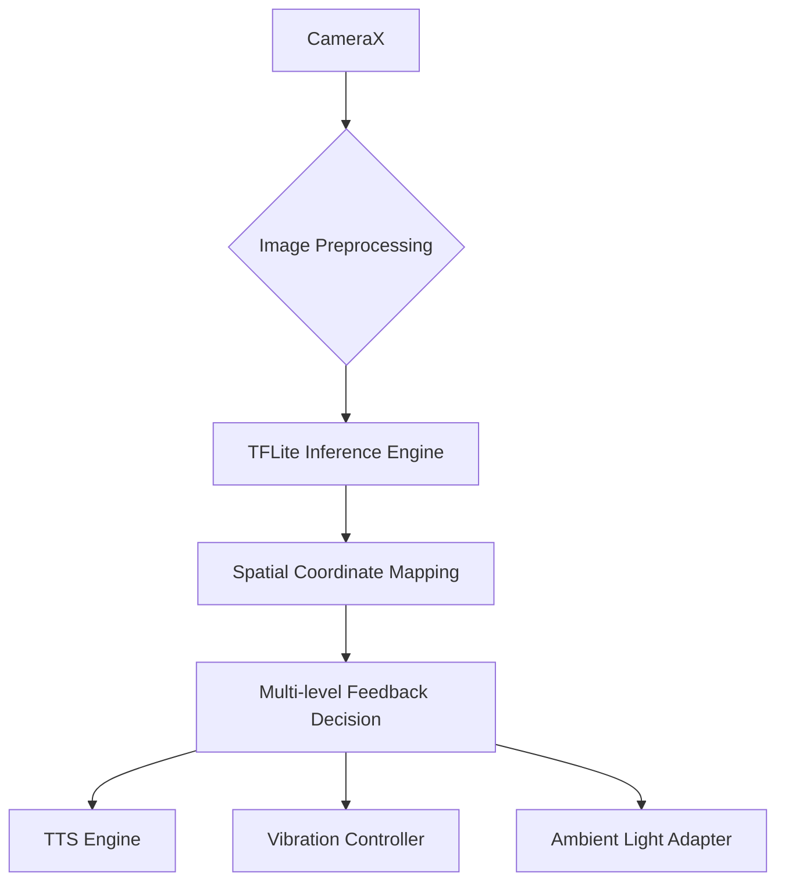
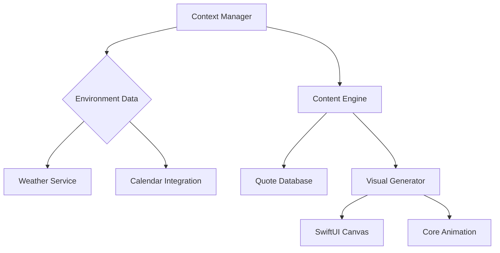
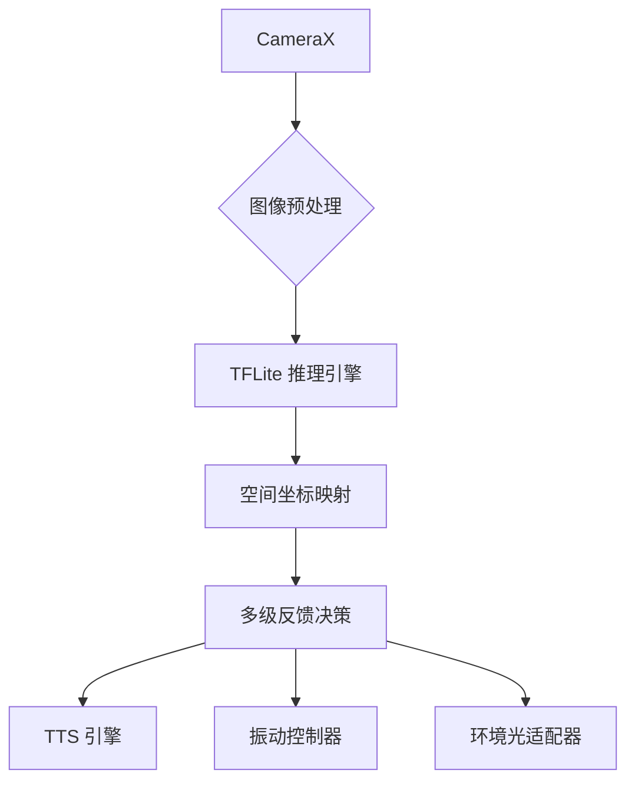
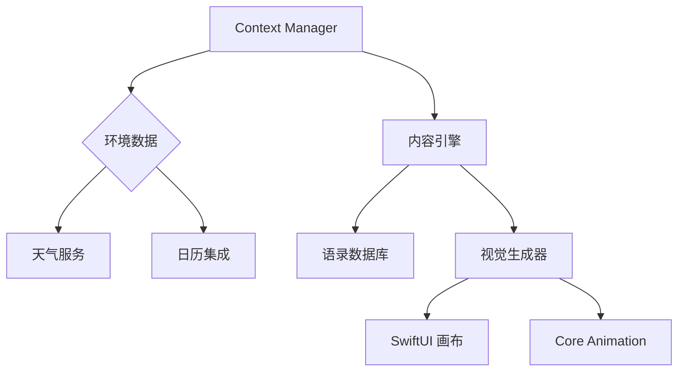

<h1 align="center">
  
</h1>

<p align="center">
  <a href="mailto:danmo6321@gmail.com">
    
  </a>
</p>

---

<!-- Language Switcher -->
<p align="right">
  <b>Language: </b>
  <a href="#english-version">English</a> |
  <a href="#chinese-version">中文</a>
</p>

---

<!-- ENGLISH VERSION -->
<div id="english-version">

## 🧑‍💼 About Me

- 💻 Focused on innovative fusion of mobile and AI technologies
- 🧠 Passionate about audio/video, real-time communication, and system performance
- 🌱 Currently exploring Edge AI, cross-platform development, and WebAssembly

---

## 📑 Table of Contents

- [🧰 Technical Toolbox](#-technical-toolbox)
- [🚀 Featured Innovations](#-featured-innovations)
- [📊 Development Analytics](#-development-analytics)
- [🧭 Current Exploration Trajectory](#-current-exploration-trajectory)
- [📣 Contact](#-contact)

---

## 🧰 Technical Toolbox

### **Core Competencies**
<p align="center">
  
</p>

### **Deep Expertise**
| Category       | Technologies                                                                 |
|----------------|-----------------------------------------------------------------------------|
| Mobile Native  | Android NDK • Core Audio • ARCore • Metal API • Kotlin Multiplatform        |
| Real-time      | WebRTC • gRPC • WebSocket • Socket.IO • LiveData                            |
| Architecture   | Clean Architecture • MVI • MVVM • Event Sourcing • CQRS                    |
| Performance    | Proguard • R8 • Hermes • V8 Optimization • SIMD Instructions               |

---

## 🚀 Featured Innovations

### 👁️ [Intelligent Navigation Assistant](https://github.com/ruv2005/guide)
[](https://www.tensorflow.org/lite)
[]()
[]()

> **A real-time spatial awareness and navigation app for the visually impaired, supporting 80+ object detection, sub-400ms end-to-end latency, and 98% device compatibility.**

**Technical Triumphs**:
- Real-time 80+ object detection with <400ms latency (Optimized EfficientDet-Lite0)
- 16-direction spatial localization (±5° precision)
- 98% device compatibility (full-series Huawei/Xiaomi support)

**Performance Metrics**:
```text
├── Inference Speed: 350ms (Readmi K80)
├── Memory Footprint: 18MB (TensorFlow Lite)
├── Power Consumption: 2.3mA avg (Light-sensing mode)
└── Frame Processing: 21.3fps @ 640x480
```

**System Architecture**:


---

### 💡 [MingMou](https://github.com/ruv2005/mingmou)
[](https://developers.google.com/ml-kit)
[]()

> **A hybrid online+offline OCR application for low-vision and visually impaired users. Supports classroom PPT/blackboard reading and physical book reading, with seamless switching between the built-in camera and external ESP32-CAM device via AP mode video streaming.**

**Key Highlights**:
- Both cloud and on-device OCR for robust and private text recognition
- Specially optimized for classroom: Real-time projection/PPT/blackboard reading
- ESP32-CAM as an external camera: phone connects via AP mode and streams video for OCR, ideal for reading physical books or documents
- Seamless hot switching between internal and ESP32-CAM without interruption
- Fully accessible UI and voice feedback

**Core Metrics**:
```text
├── OCR Latency: <350ms (offline mode)
├── ESP32-CAM Switch Time: <1s (hot swap, AP mode)
├── Scene Adaptation: Classroom, slides, blackboard, books
└── Battery Impact: <3mA (typical classroom use)
```

---

### 🖥️ [ScreenSaver Motivator](https://github.com/ruv2005/screensaver)
[](https://developer.apple.com/xcode/swiftui/)
[]()

> **A dynamic screensaver + motivational quotes engine, integrating calendar, weather, and visual generation for daily inspiration.**

**Architecture**:


---

## 📊 Development Analytics

<div align="center">

[](https://github.com/ashutosh00710/github-readme-activity-graph)

[](https://github.com/anuraghazra/github-readme-stats)

</div>

---

## 🧭 Current Exploration Trajectory

- **Edge AI**: EfficientDet quantization strategy optimization (98% INT8 accuracy retention)
- **Audio Processing**: On-device ML-based noise suppression (TF-Lite)
- **Cross-Platform**: Shared KMM audio module for Android/iOS
- **Performance**: WebAssembly SIMD optimization for real-time AV processing

---

## 📣 Contact

- Email: danmo6321@gmail.com
- WeChat: danmo6321

</div>

---

<!-- CHINESE VERSION -->
<details>
<summary id="chinese-version">🇨🇳 点击展开中文版 / Chinese Version</summary>

## 🧑‍💼 关于我

- 💻 专注移动端与 AI 融合创新
- 🧠 热衷音视频/实时通信/系统性能优化
- 🌱 目前关注 Edge AI、跨端开发、WebAssembly

---

## 📑 目录

- [🧰 技术栈](#-technical-toolbox)
- [🚀 代表性项目](#-featured-innovations)
- [📊 开发数据分析](#-development-analytics)
- [🧭 近期探索方向](#-current-exploration-trajectory)
- [📣 联系方式](#联系方式)

---

## 🧰 技术栈

### **核心能力**
<p align="center">
  
</p>

### **深度专长**
| 分类           | 技术栈                                                                   |
|----------------|--------------------------------------------------------------------------|
| 移动原生       | Android NDK • Core Audio • ARCore • Metal API • Kotlin Multiplatform     |
| 实时通信       | WebRTC • gRPC • WebSocket • Socket.IO • LiveData                         |
| 架构设计       | Clean Architecture • MVI • MVVM • Event Sourcing • CQRS                  |
| 性能优化       | Proguard • R8 • Hermes • V8 优化 • SIMD 指令集                          |

---

## 🚀 代表性项目

### 👁️ [智能导航助手](https://github.com/ruv2005/guide)
[](https://www.tensorflow.org/lite)
[]()
[]()

> **为视障人士设计的实时空间感知与导航应用，支持 80+ 目标检测，端到端延迟低于 400ms，兼容 98% 主流安卓设备。**

**技术亮点**:
- 实时 80+ 目标检测，延迟 <400ms（高效 EfficientDet-Lite0 优化）
- 采用六向（2×3矩阵）空间定位方式，定位精度高达±5°，符合人体直观感知习惯，更易于理解和使用
- 设备兼容率 98%（全系华为/小米适配）

**性能参数**:
```text
├── 推理速度: 350ms (Readmi K80)
├── 内存占用: 18MB (TensorFlow Lite)
├── 功耗: 2.3mA 平均 (光感模式)
└── 帧处理: 21.3fps @ 640x480
```

**系统架构**:


---

### 💡 [明眸 (MingMou)](https://github.com/ruv2005/mingmou)
[](https://developers.google.com/ml-kit)
[]()

> **一款融合在线+离线 OCR 的应用，专为低视力和视力障碍人士设计。支持课堂 PPT/黑板和实体书的阅读场景，通过 AP 模式连接 ESP32-CAM 实现外置摄像头视频流，内置/外置摄像头无缝热切换，极致无障碍体验。**

**主要特性**:
- 云端+本地 OCR 混合，保障离线及隐私需求
- 针对课堂环境优化：PPT、黑板、讲义实时朗读
- 支持实体书、文档等近距离阅读
- 创新 ESP32-CAM 外置摄像头接入，手机直连 AP，低延迟视频流 OCR
- 内置/ESP32-CAM 摄像头一键无缝切换
- 无障碍友好 UI 与语音反馈

**核心参数**:
```text
├── OCR 延迟: <350ms（离线模式）
├── ESP32-CAM 切换: <1s（热切换）
├── 场景适配: 教室、投影、黑板、实体书
└── 电池影响: <3mA（典型课堂使用）
```

---

### 🖥️ [励志屏保](https://github.com/ruv2005/screensaver)
[](https://developer.apple.com/xcode/swiftui/)
[]()

> **动态屏保 + 激励语录引擎，结合日历、天气与视觉生成，提升日常专注力。**

**架构图**:


---

## 📊 开发数据分析

<div align="center">

[](https://github.com/ashutosh00710/github-readme-activity-graph)

[](https://github.com/anuraghazra/github-readme-stats)

</div>

---

## 🧭 近期探索方向

- **Edge AI**: EfficientDet 量化策略优化（INT8 精度保留 98%）
- **音频处理**: 基于 TF-Lite 的端侧降噪
- **跨平台**: Android/iOS 共用 KMM 音频模块
- **性能优化**: WebAssembly SIMD 实时音视频加速

---

## 📣 联系方式

- 邮箱: danmo6321@gmail.com
- 微信: danmo6321

</details>

---

<!--START_SECTION:waka-->


**🐱 My GitHub Data** 

> 📦 211.6 kB Used in GitHub's Storage 
 > 
> 🏆 106 Contributions in the Year 2025
 > 
> 🚫 Not Opted to Hire
 > 
> 📜 14 Public Repositories 
 > 
> 🔑 2 Private Repositories 
 > 
**I'm an Early 🐤** 

```text
🌞 Morning                62 commits          ███████░░░░░░░░░░░░░░░░░░   29.38 % 
🌆 Daytime                85 commits          ██████████░░░░░░░░░░░░░░░   40.28 % 
🌃 Evening                32 commits          ████░░░░░░░░░░░░░░░░░░░░░   15.17 % 
🌙 Night                  32 commits          ████░░░░░░░░░░░░░░░░░░░░░   15.17 % 
```
📅 **I'm Most Productive on Tuesday** 

```text
Monday                   45 commits          █████░░░░░░░░░░░░░░░░░░░░   21.33 % 
Tuesday                  67 commits          ████████░░░░░░░░░░░░░░░░░   31.75 % 
Wednesday                12 commits          █░░░░░░░░░░░░░░░░░░░░░░░░   05.69 % 
Thursday                 16 commits          ██░░░░░░░░░░░░░░░░░░░░░░░   07.58 % 
Friday                   39 commits          █████░░░░░░░░░░░░░░░░░░░░   18.48 % 
Saturday                 14 commits          ██░░░░░░░░░░░░░░░░░░░░░░░   06.64 % 
Sunday                   18 commits          ██░░░░░░░░░░░░░░░░░░░░░░░   08.53 % 
```


📊 **This Week I Spent My Time On** 

```text
🕑︎ Time Zone: Asia/Shanghai

💬 Programming Languages: 
No Activity Tracked This Week

🔥 Editors: 
No Activity Tracked This Week

🐱‍💻 Projects: 
No Activity Tracked This Week

💻 Operating System: 
No Activity Tracked This Week
```

**I Mostly Code in Kotlin** 

```text
Kotlin                   5 repos             ██████████░░░░░░░░░░░░░░░   41.67 % 
Dart                     1 repo              ██░░░░░░░░░░░░░░░░░░░░░░░   08.33 % 
Swift                    1 repo              ██░░░░░░░░░░░░░░░░░░░░░░░   08.33 % 
TypeScript               1 repo              ██░░░░░░░░░░░░░░░░░░░░░░░   08.33 % 
Shell                    1 repo              ██░░░░░░░░░░░░░░░░░░░░░░░   08.33 % 
```


**Timeline**


 Last Updated on 17/11/2025 18:50:19 UTC
<!--END_SECTION:waka-->
