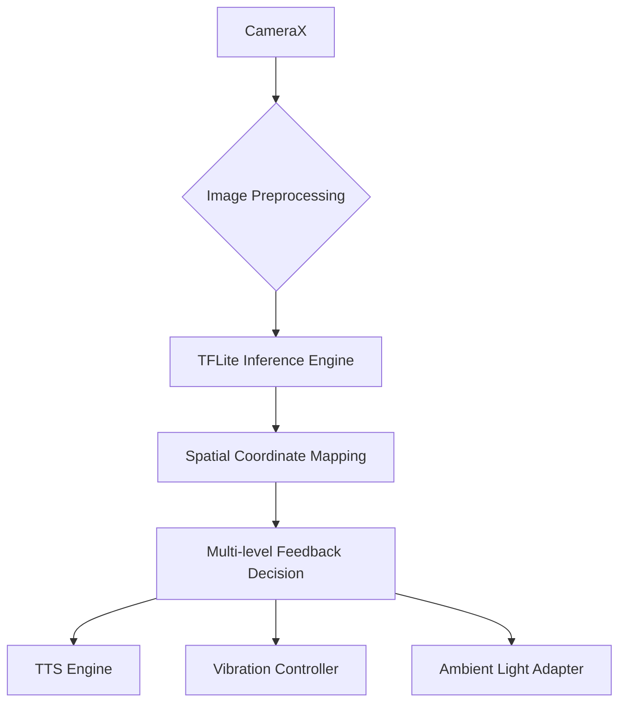
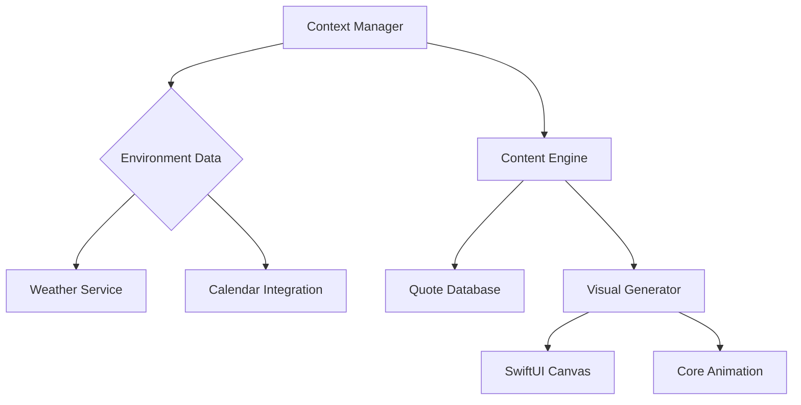

<h1 align="center">
  
</h1>

<p align="center">
  <a href="mailto:danmo6321@gmail.com">
    
  </a>
</p>

---

## 🧰 Technical Toolbox

### **Core Competencies**
<p align="center">
  
</p>

### **Deep Expertise**
| Category       | Technologies                                                                 |
|----------------|-----------------------------------------------------------------------------|
| Mobile Native  | Android NDK • Core Audio • ARCore • Metal API • Kotlin Multiplatform        |
| Real-time      | WebRTC • gRPC • WebSocket • Socket.IO • LiveData                            |
| Architecture   | Clean Architecture • MVI • MVVM • Event Sourcing • CQRS                    |
| Performance    | Proguard • R8 • Hermes • V8 Optimization • SIMD Instructions               |

---

## 🚀 Featured Innovations

### 👁️ [Intelligent Navigation Assistant](https://github.com/ruv2005/guide)
[](https://www.tensorflow.org/lite)
[]()
[]()

**Technical Triumphs**:
- Real-time 80+ object detection with <400ms latency (Optimized EfficientDet-Lite0)
- 16-direction spatial localization (±5° precision)
- 98% device compatibility rate (Huawei/Xiaomi full-series support)

**Performance Metrics**:
```text
├── Inference Speed: 350ms (Readmi K80)
├── Memory Footprint: 18MB (TensorFlow Lite)
├── Power Consumption: 2.3mA avg (Light-sensing mode)
└── Frame Processing: 21.3fps @ 640x480
```

**System Architecture**:


### 🔊 [Loud Speaker Android](https://github.com/ruv2005/LOUD-SPEAKER-ANDROID)
[]()

**Technical Triumphs**:
- Achieved <600ms audio latency using custom OpenSL ES pipeline
- Implemented real-time FFT processing with NEON intrinsics
- Developed cross-thread synchronization using lock-free queues

**Key Metrics**:
```text
├── Audio Latency: 500ms (95th percentile)
├── Memory Usage: 12MB resident size
└── CPU Utilization: 18% avg (SDM845)
```

### 🖥️ [ScreenSaver Motivator](https://github.com/ruv2005/screensaver)
[](https://developer.apple.com/xcode/swiftui/)
[]()

**Architecture**:


---

## 📊 Development Analytics

<div align="center">

[](https://github.com/ashutosh00710/github-readme-activity-graph)

</div>

---

## 🧭 Current Exploration Trajectory

- **Edge AI**: Optimizing EfficientDet quantization strategies (98% INT8 accuracy retention)
- **Audio Processing**: Developing ML-based noise suppression using TF-Lite
- **Cross-Platform**: Shared KMM module for Android/iOS audio pipelines
- **Performance**: WebAssembly SIMD optimizations for real-time processing

---

<!--START_SECTION:waka-->


**🐱 My GitHub Data** 

> 📦 158.1 kB Used in GitHub's Storage 
 > 
> 🚫 Not Opted to Hire
 > 
> 📜 12 Public Repositories 
 > 
> 🔑 2 Private Repositories 
 > 
**I'm an Early 🐤** 

```text
🌞 Morning                36 commits          ████████░░░░░░░░░░░░░░░░░   30.77 % 
🌆 Daytime                42 commits          █████████░░░░░░░░░░░░░░░░   35.90 % 
🌃 Evening                18 commits          ████░░░░░░░░░░░░░░░░░░░░░   15.38 % 
🌙 Night                  21 commits          ████░░░░░░░░░░░░░░░░░░░░░   17.95 % 
```
📅 **I'm Most Productive on Friday** 

```text
Monday                   29 commits          ██████░░░░░░░░░░░░░░░░░░░   24.79 % 
Tuesday                  28 commits          ██████░░░░░░░░░░░░░░░░░░░   23.93 % 
Wednesday                7 commits           █░░░░░░░░░░░░░░░░░░░░░░░░   05.98 % 
Thursday                 0 commits           ░░░░░░░░░░░░░░░░░░░░░░░░░   00.00 % 
Friday                   33 commits          ███████░░░░░░░░░░░░░░░░░░   28.21 % 
Saturday                 9 commits           ██░░░░░░░░░░░░░░░░░░░░░░░   07.69 % 
Sunday                   11 commits          ██░░░░░░░░░░░░░░░░░░░░░░░   09.40 % 
```


📊 **This Week I Spent My Time On** 

```text
🕑︎ Time Zone: Asia/Shanghai

💬 Programming Languages: 
Kotlin                   38 mins             ██████████████████████░░░   86.55 % 
PowerShell               3 mins              ██░░░░░░░░░░░░░░░░░░░░░░░   07.04 % 
Bash                     1 min               █░░░░░░░░░░░░░░░░░░░░░░░░   03.72 % 
Groovy                   0 secs              █░░░░░░░░░░░░░░░░░░░░░░░░   02.17 % 
Python                   0 secs              ░░░░░░░░░░░░░░░░░░░░░░░░░   00.52 % 

🔥 Editors: 
Android Studio           39 mins             ██████████████████████░░░   88.71 % 
VS Code                  4 mins              ███░░░░░░░░░░░░░░░░░░░░░░   11.29 % 

🐱‍💻 Projects: 
guide                    39 mins             ██████████████████████░░░   88.71 % 
桌面                       3 mins              ██░░░░░░░░░░░░░░░░░░░░░░░   07.04 % 
obstacle-detection       1 min               █░░░░░░░░░░░░░░░░░░░░░░░░   04.24 % 

💻 Operating System: 
Windows                  44 mins             █████████████████████████   100.00 % 
```

**I Mostly Code in Kotlin** 

```text
Kotlin                   4 repos             ██████████░░░░░░░░░░░░░░░   40.00 % 
Dart                     1 repo              ██░░░░░░░░░░░░░░░░░░░░░░░   10.00 % 
Swift                    1 repo              ██░░░░░░░░░░░░░░░░░░░░░░░   10.00 % 
TypeScript               1 repo              ██░░░░░░░░░░░░░░░░░░░░░░░   10.00 % 
Shell                    1 repo              ██░░░░░░░░░░░░░░░░░░░░░░░   10.00 % 
```


**Timeline**


 Last Updated on 12/03/2025 18:47:45 UTC
<!--END_SECTION:waka-->
